# Task Extraction Pipeline — Diagram

How GOV.UK pages become a curated long list of structured citizen-facing tasks.

```mermaid
flowchart TD
    classDef code fill:#e8f4f8,stroke:#2b6cb0,color:#1a365d
    classDef llm fill:#fefcbf,stroke:#d69e2e,color:#744210
    classDef review fill:#fed7e2,stroke:#d53f8c,color:#702459
    classDef artefact fill:#f0fff4,stroke:#38a169,color:#22543d
    classDef io fill:#e9d8fd,stroke:#805ad5,color:#44337a

    IN["GOV.UK subgraph JSON\n31 pages, Having a Baby"]:::io

    S01["STAGE 0-1 Sections\nsections.py\nParse pages and guide parts\nSplit into sentences\nAssign stable evidence IDs"]:::code
    A01["sentences.csv\none row per sentence"]:::artefact

    S2["STAGE 2 Candidates\ncandidates.py\nPattern flags and optional LLM flagging\nmodals, imperatives, deadlines, CTA links"]:::llm
    A2["candidates.csv\nflagged sentences with labels and keep column"]:::artefact

    R1{"REVIEW 1\nInspect candidates.csv\nSet keep Y or N"}:::review

    S3["STAGE 3 Section Drafts\ndrafts.py and llm.py\nOne LLM call per section with keep=Y sentences\n0 to n Draft objects per section\nValidate each draft, retry once on failure"]:::llm
    A3["drafts.jsonl and drafts_rejected.jsonl\n250-350 drafts across 120-160 LLM calls"]:::artefact

    R2{"REVIEW 2\nInspect drafts_review.csv\nCheck faithfulness to source text"}:::review

    S4a["STAGE 4a Blocking\nreconcile/blocking.py\nPre-merge near-duplicates at 90 pct title match\nGroup remainder by policy family"]:::code

    S4b["STAGE 4b Clustering\nreconcile/clustering.py\nOne LLM call per policy-family group\nAssigns roles: primary, same, sub_task\nValidate, retry, repair, fallback"]:::llm

    S4c["STAGE 4c Merge\nreconcile/merge.py\nDeterministic field-level merge per cluster\nConsensus rules, fuzzy dedup of cited lists\nNothing-lost assertion"]:::code
    A4["clusters.csv and conflicts.csv\ngrouping decisions and field disagreements"]:::artefact

    R3{"REVIEW 3\nInspect clusters.csv and conflicts.csv\nVerify grouping, resolve conflicts"}:::review

    S5["STAGE 5 Validate and Report\nchecks.py and review.py and reports.py\nSemantic checks on every task\nfunnel, coverage, validation, diff reports"]:::code

    OUT["tasks.json\nCurated long list of structured\ncitizen-facing task records"]:::io

    CACHE[("LLM cache\ndata/cache/\nkeyed by prompt version\nand model and input hash")]:::artefact
    SCHEMA["schema.py\nDraft, TaskRecord, vocabularies\nnormalise, synonym tables"]:::code

    IN --> S01
    S01 --> A01
    A01 --> S2
    S2 --> A2
    A2 --> R1
    R1 --> S3
    S3 --> A3
    A3 --> R2
    R2 --> S4a
    S4a --> S4b
    S4b --> S4c
    S4c --> A4
    A4 --> R3
    R3 --> S5
    S5 --> OUT

    CACHE -.- S3
    CACHE -.- S4b
    SCHEMA -.- S3
    SCHEMA -.- S4c
    SCHEMA -.- S5
```

## Legend

| Colour | Meaning |
|--------|---------|
| Blue | Code-only stage (deterministic, no LLM) |
| Yellow | Stage that includes LLM calls (AWS Bedrock) |
| Pink | Human review gate |
| Green | Artefact (file written to disk) |
| Purple | Pipeline input / output |

## Key design principles

1. **Each LLM call is small and focused** — one section at a time (stage 3), one policy-family group at a time (stage 4b). No call asks the LLM to rewrite records it already produced.
2. **Code merges, LLM decides** — the LLM only decides *which* drafts belong together (clustering). All field-level merging is deterministic code with a nothing-lost assertion.
3. **Three review gates** — candidates, drafts, and clusters can each be inspected and corrected before the next stage runs.
4. **Cached and repeatable** — LLM outputs are cached by prompt version + model + input hash. Re-runs with no changes make zero LLM calls; editing one page only re-calls that page's sections.
